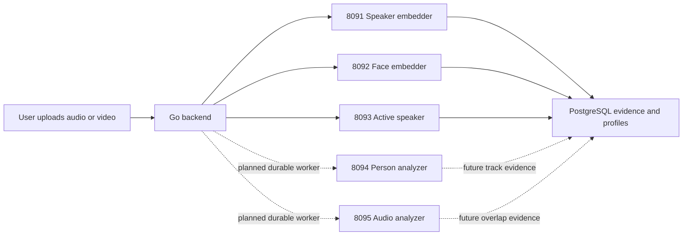

# ML services: end-to-end guide

This repository runs five private ML services beside the Go backend. The
backend owns users, uploaded files, retries, database writes, and final
identity decisions. The ML services only return evidence.

## What each service does

| Port | Service | Model(s) | Use in this repository | Backend status |
| --- | --- | --- | --- | --- |
| 8091 | speaker-embedder | SpeechBrain ECAPA | Turns a short owner voice clip or speech segment into a voice signature for account-scoped matching. | Live |
| 8092 | face-embedder | YuNet + SFace | Detects a face and creates its face signature for enrollment and visual matching. | Live |
| 8093 | active-speaker | TalkNet | Scores which visible person is speaking during an already-timed speech segment. | Live |
| 8094 | person-analyzer | YuNet + SFace + tracker | Finds every face through a video and keeps one physical person under one track ID. | Service ready; worker wiring pending |
| 8095 | audio-analyzer | pyannote + SepFormer | Finds speech, silence, and overlap; attempts to split overlapping voices. | Service ready; worker wiring pending |

“Live” means the backend creates the client and calls the service during its
current face, voice, or video flow. “Worker wiring pending” means the endpoint,
database schema, and validated Go client exist, but normal uploads do not call
it yet. This is intentional: dense tracking and overlap analysis need durable
per-stage jobs before they can safely run on every recording.

## How the pieces fit



The dashed paths are not enabled for normal uploads yet. Do not turn on
automatic identity merging: ambiguous evidence must remain ambiguous.

## One-time local setup

### 1. Prerequisites

- Docker Desktop is running.
- At least 12 GB Docker memory is available for the full local stack.
- The Go backend database is running and `backend/.env` is configured.

The root `.env` contains local service keys for the two new analyzers. It is
Git-ignored and must never be committed.

### 2. Download face models

```bash
cd /Users/arham/Documents/ai-second-brain/face-embedder
./download-models.sh
```

This supplies YuNet and SFace to both `face-embedder` and
`person-analyzer`.

### 3. Download audio models

Accept the Hugging Face terms for pyannote Community-1, create a read-only
Hugging Face token, then run:

```bash
cd /Users/arham/Documents/ai-second-brain
HF_TOKEN=your_token PYANNOTE_REVISION=your_reviewed_commit_sha make audio-models
```

This saves pyannote and SepFormer under `audio-analyzer/models/` and generates
`SHA256SUMS`. The files are ignored by Git. Do not put the token in an env
file or commit it.

### 4. Start all five services

```bash
cd /Users/arham/Documents/ai-second-brain
make ml-up
```

Equivalent command:

```bash
docker compose -f compose.ml.yaml up --build -d
```

### 5. Verify every service

```bash
curl http://127.0.0.1:8091/healthz
curl http://127.0.0.1:8092/healthz
curl http://127.0.0.1:8093/healthz
curl http://127.0.0.1:8094/readyz
curl http://127.0.0.1:8095/readyz
```

Every command should return an `ok` response. For a failure:

```bash
docker compose -f compose.ml.yaml logs -f audio-analyzer
docker compose -f compose.ml.yaml logs -f person-analyzer
```

## Configure and start the backend

Set these values in `backend/.env` to enable the three services already used
by the backend:

```dotenv
APP_SPEAKER_EMBEDDING_PROVIDER=local
APP_SPEAKER_EMBEDDING_BASE_URL=http://127.0.0.1:8091
APP_SPEAKER_EMBEDDING_MODEL=speechbrain/spkrec-ecapa-voxceleb

APP_FACE_RECOGNITION_PROVIDER=local
APP_FACE_RECOGNITION_BASE_URL=http://127.0.0.1:8092
APP_FACE_RECOGNITION_MODEL=opencv/sface-2021dec@sha256:0ba9fbfa01b5270c96627c4ef784da859931e02f04419c829e83484087c34e79

APP_ACTIVE_SPEAKER_PROVIDER=local
APP_ACTIVE_SPEAKER_BASE_URL=http://127.0.0.1:8093
APP_ACTIVE_SPEAKER_MODEL=talknet/talkset-v1

APP_ACTIVE_SPEAKER_AUTO_LINK=false
APP_PERSON_AUTO_MERGE=false
```

Start the backend:

```bash
cd /Users/arham/Documents/ai-second-brain
make -C backend run
```

The backend validates face and active-speaker service compatibility at startup.
Read the startup logs before uploading media.

## Current end-to-end flows

### Face enrollment and visual identification

1. A user enrolls a face image through the backend.
2. The backend sends the image to `face-embedder`.
3. YuNet finds the face; SFace creates a numeric signature.
4. The backend stores the signature only in account-scoped storage.
5. Video analysis can compare later face observations against that owner’s
   enrolled signatures.

### Voice enrollment and speaker identification

1. A user uploads a short voice enrollment sample.
2. The backend extracts usable audio and sends it to `speaker-embedder`.
3. ECAPA creates a numeric voice signature.
4. The backend stores an account-scoped speaker profile.
5. When a voice recording is processed, the backend compares segment
   signatures with that owner’s saved speaker profiles.

### Video active-speaker evidence

1. The backend extracts video evidence and has timed speech segments.
2. It sends the video path, person tracks, and segment times to
   `active-speaker`.
3. TalkNet estimates which visible face matches the active voice.
4. The backend stores the score as identity evidence.
5. Automatic linking remains disabled unless you deliberately enable it after
   reviewing evidence.

### Dense person and overlap-audio analysis

`person-analyzer` and `audio-analyzer` are running and their Go clients
validate model provenance, timing, and output shape. Their results are not yet
scheduled by the normal backend workers.

The next implementation step is to create durable `dense_person_tracking`
and `audio_analysis` stage jobs, persist their output, and then activate a
completed processing version. Track this work in
`MULTIMODAL_PIPELINE_PROGRESS.md`.

## Debugging safely

The admin Pipeline Lab frontend currently tests only the three live services:
Face, Speaker, and Active speaker. It does not yet expose Person analyzer or
Audio analyzer because those endpoints are not connected to durable backend
workers.

Useful commands:

```bash
docker compose -f compose.ml.yaml ps
docker compose -f compose.ml.yaml logs -f audio-analyzer
docker compose -f compose.ml.yaml logs -f person-analyzer
make ml-down
```

`make ml-down` stops the ML containers. It does not delete downloaded models,
database data, or uploaded media.

## Apple Silicon and production notes

The audio analyzer runs as `linux/amd64`. pyannote 4 requires
`torchcodec==0.7.0`, and that release has no Linux ARM64 wheel. Docker Desktop
emulates AMD64 on Apple Silicon, so local audio analysis is slower and Docker
shows an AMD64 performance warning. This is expected.

For production:

- Use a Linux AMD64 host; use GPU only after adding and validating the CUDA
  profile.
- Keep model mounts read-only, containers non-root, and API keys separate.
- Keep every model pinned and checksum-verified.
- Put externally hosted services behind HTTPS and use bearer keys.
- Do not enable automatic profile merges until labeled evaluation and review
  thresholds exist.
